# README.md for Photography for Beginners Website
## Website designed by Rachel Lawson. 
Student number L3007866 at South Staffordshire College.
View live website here https://rach-design1.github.io/Photography-for-beginners/

# Index - Table of Contents:
* Welcome
* User Experience (UX)
* Features
* Design - Wireframes & Site Map
* Responsive Design
* Testing
* Deployment
* Credits
* Additional information/Improving my learning experience
* Goodbye

## Welcome
Hi User, Welcome to my README.md for 'Photography for Beginners' website. I hope you enjoy using the site and it makes you want to pick up a Camera. 

## User Experience (UX)

### Project Goals:
The main Project Goal of this website is to teach the User (a Beginner Photographer) to take their first Photographs. 

### Developer and Business Goals:
The Developer and Business Goal is for the user (a Beginner Photographer) to book a lesson, as a lot of hobbyist photographers just take photos and don't have lessons.  However it is beneficial to have lessons to progress and also to meet people if joining a camera club. 

### User Story:
The User Story of this website is that the user will learn the basics of Photographer to take their first Photo and to then enquire about a lesson, if they would like to. 

The website will mainly attract new users as once they have been on the website, they will go off and take photographs and then if they come back to the website as a returning user it would be to book a lesson. However, they might book a lesson on their first website visit, but then return to refresh themselves on information and the lesson schedules. If I was developing this site further, then this could be an opportunity to grow the site by adding a blog with additional online lessons; this could incorporate a video as well as text for better accessibility needs.

## Features
#### Please see the features that are featured on my pages below. The website has four pages, these are: Index/Home, Taking a Photo, Portfolio and Book a Lesson.

### Index/Home Page:

This page has a few main features. I wanted the design to be simple and not distracting to the user, especially as the website aim is for beginner photographers who just need basic information so they can take a photo, plus also access to be able to sign up to Photography lessons.

#### Logo
The page has a Logo on the top left next to the Navigation Bar. I like how the logo is positioned here and is clear and unobtrusive.
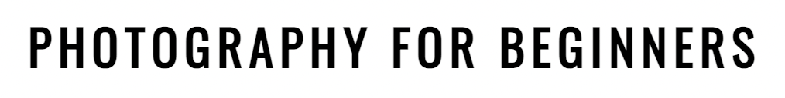
#### Navigation Bar 
The page consists of a navigation bar to enable users to easily navigate around the site at their greatest convenience and leisure. To the left of the Navigation bar is my site logo "Photography for Beginners' I love how simple and elegant it looks and not too distracting!
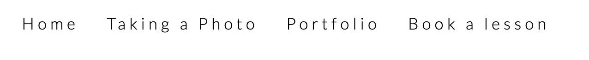

#### Image 
There is a photo of a woman taking a photo, I purposely chose a female Photographer as there is still a lot more men in Photography than Women, so I wanted to encourage Women that they can do it too. 
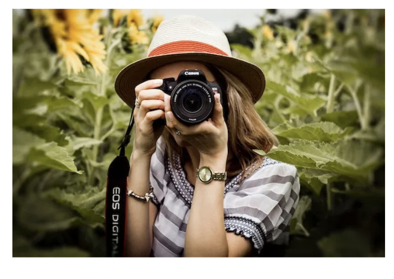

#### My vision section text box
My vision section is important as it explains my vision with the Photography website, lessons available and the studio (studio isn't actually a real studio yet (highly expensive to run), so I haven't put an address on for that reason)!  I also really like the pale blue colour as it isn't too distracting but breaks up the white a bit without too much colour! I love a white background as I find it too distracting with lots of colours and photos on a background.
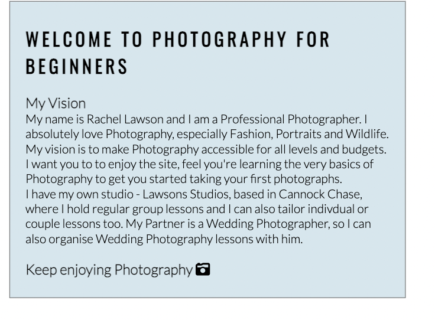

#### Photography lessons schedule
The Photography lessons schedule details the lessons available, the times and the locations.  When you navigate to the book a lesson page, it asks you to type in which lesson(s) you are looking for.  Each div has the details needed, a nice fontawesome logo picture to represent better what it is. The background image is of a camera set up to take a landscape Photograph.
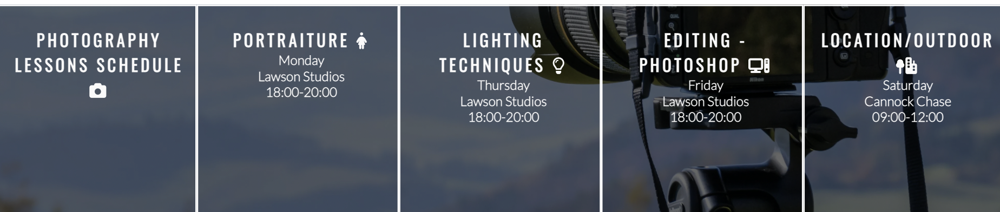

#### Footer
The Footer section has links to social media pages, these include Facebook, Twitter, Youtube and Instagram. If this was for a real Photography lesson site then these would all link to actual Photography Studio social media sites. 

### Taking a Photo Page

#### Logo and Navigation Bar
This page also has the same logo and Navigation at the top.

It has the main aim of teaching a beginner Photographer how to take their first Photo. 
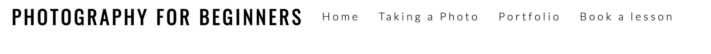

#### Taking a Photo - text box
There is a brief taking a photo section, explaining some information you will need.
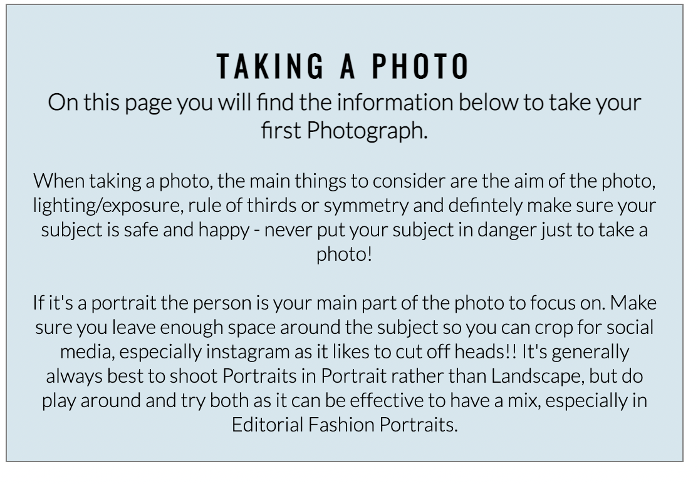

#### Image - Woman taking a photo
Next there is a photo of a woman taking a photo, this aids the visuality of the website and breaks up the text a bit, without being too distracting.
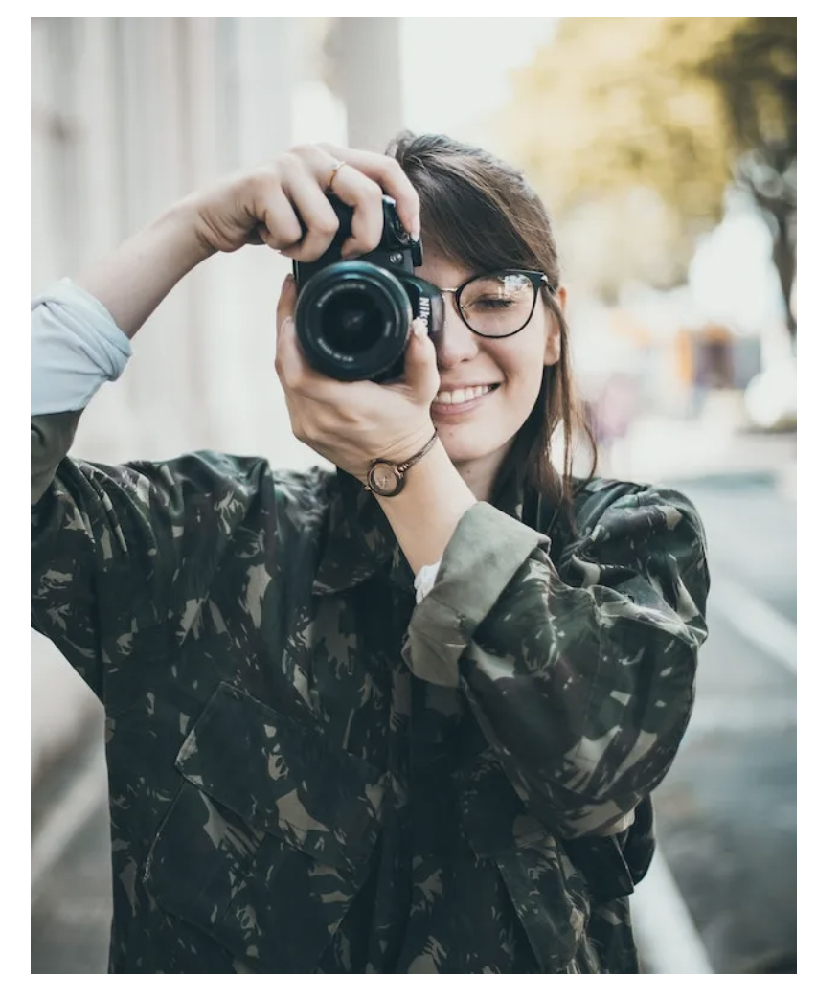

#### Exposure Triangle - text box
The section on the Exposure triangle gives a basic explanation on what it is and how it helps.
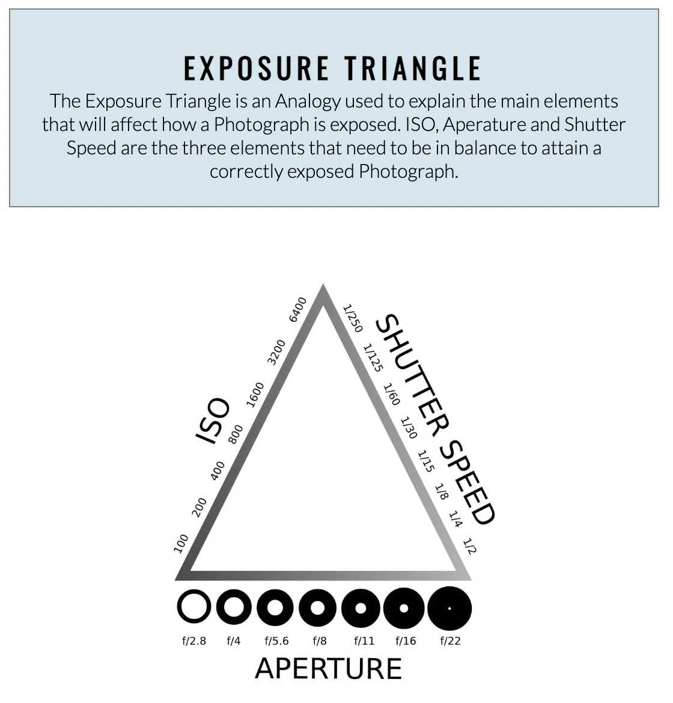

#### Exposure Triangle Diagram
The diagram image is mine I made based on the standard Exposure Triangles. 
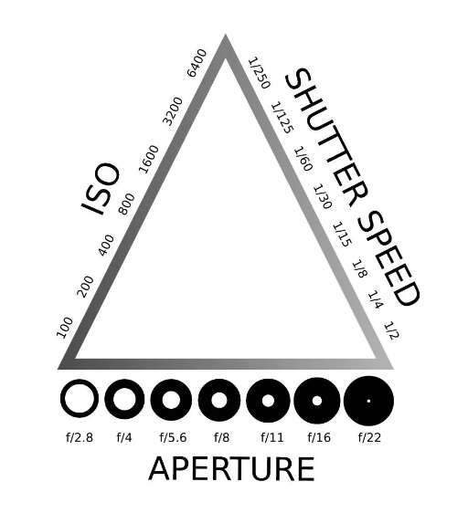

#### Step by Step - text box
Then there is a Take a Photo - Step by Step Guide. This is made up in boxes that are easy to read and similar to index page to give a consistent flow to the user. 
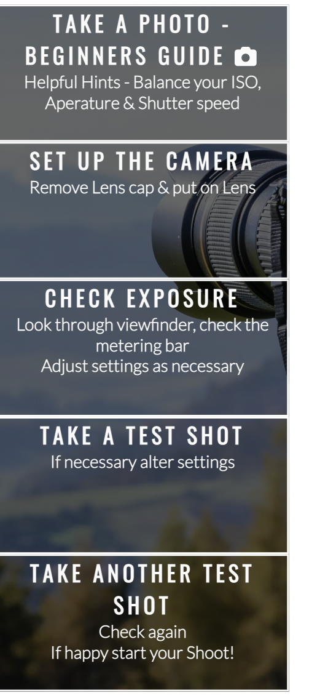

#### Footer
The same Footer section is on this page with the social media links.

### Portfolio Page:
The Portfolio page is a selection of different types of Photographs. 
I wanted a range of genres to show beginner Photographers different genres and styles they can do themselves.  There is a mix of stock photos and my own Photography photos which I hold the copyright to my own images and one from my Partner (see credits section).
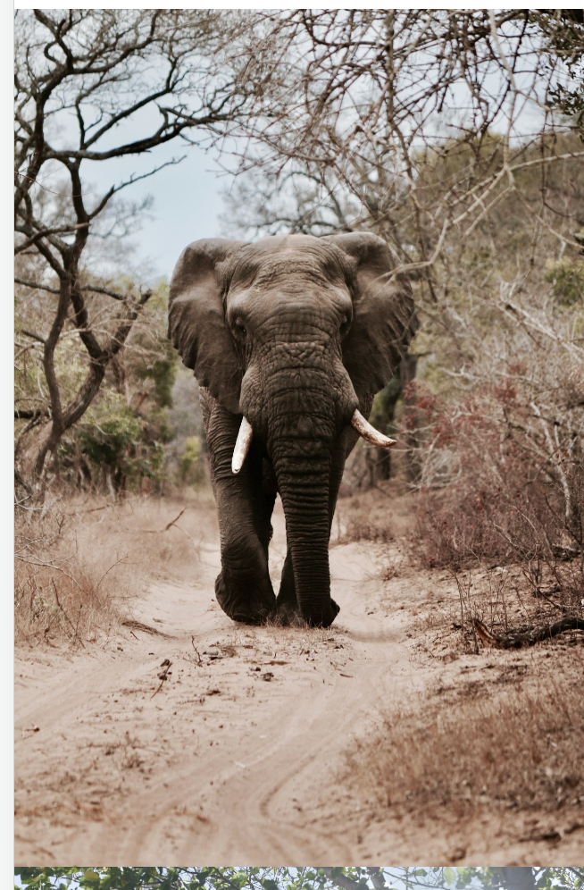

#### Logo & Navigation Bar
The same Navigation, logo are on this page too.

#### Footer
The Footer section is on this page with the social media links.

### Book a Lesson Page:
The Book a Lesson page is where the user can book a lesson and/or get in touch via phone and email (fake number and email address used for this). 

#### Booking Form
The booking form consists of the main fields of information necessary for booking a lesson: First name, Last name, Email address and a Lesson request field where they can enter the lesson they want etcs. Then a submit button. If this was a live website for a Photographer offering lessons, then the form would go to the email address via a database system, as I understand. However this form just goes to the Code Institute Form dump it said to use. 
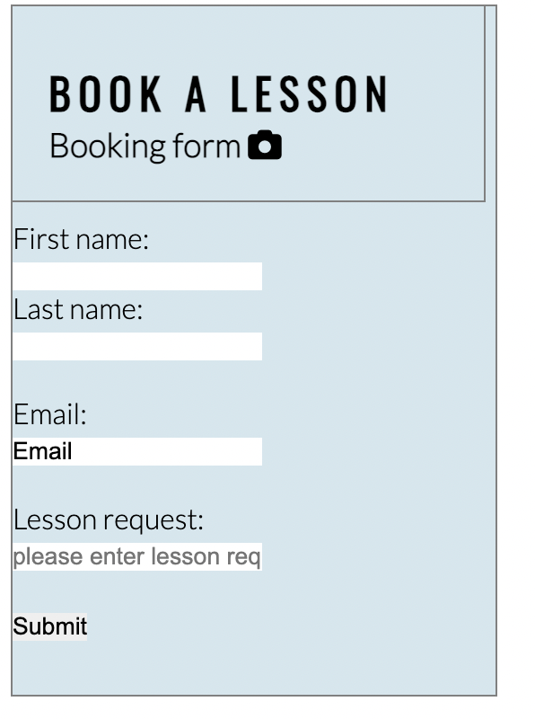

#### Get in Touch - text box
The Get in Touch div just contains a phone number and email address, as explained above these are fake just for the purpose of the course.

The boxes I used are the pale blue colouring again, I used this throughout the website as I felt it is simple yet elegant and not distracting away from the main purpose of the website.
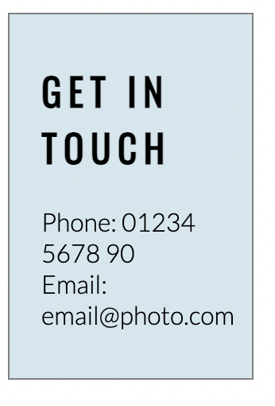

#### Footer
The Footer section is on this page with the social media links.

## Wireframes and Site Map 
The Wireframes are handwritten and attached on replit and the Site Map is made on Photoshop and attached on Replit. Please find both below.
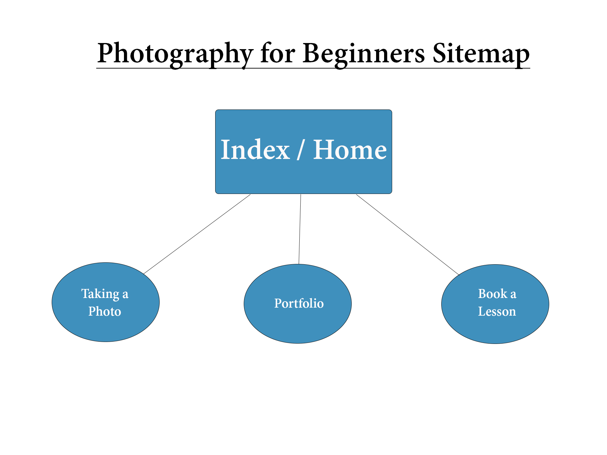
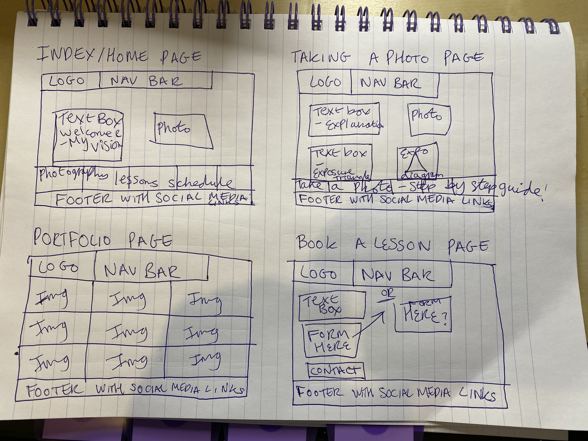
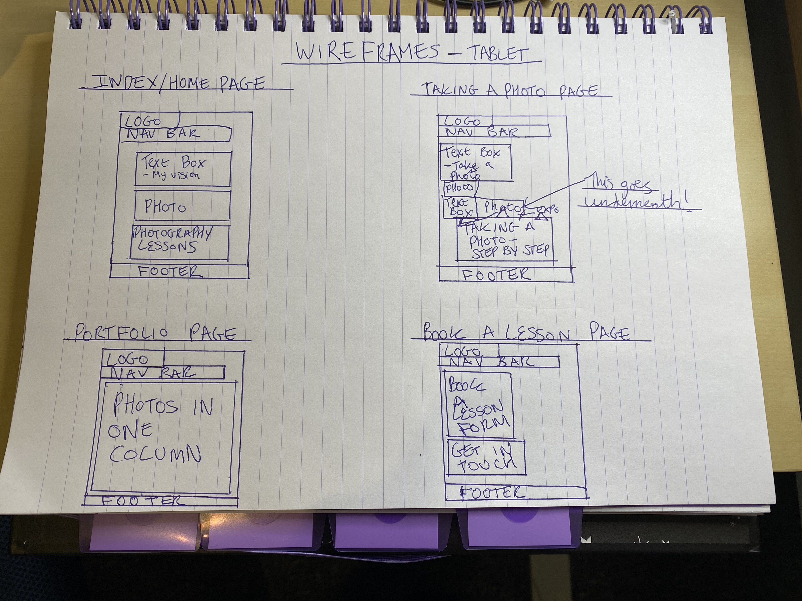
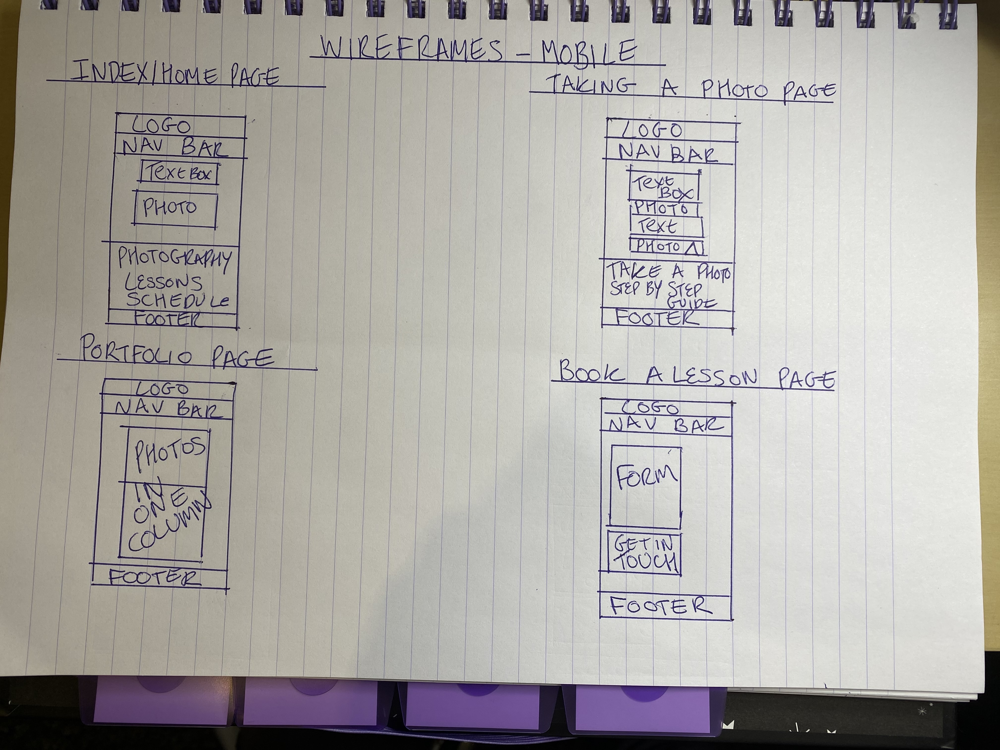

## Responsive Design 
Responsive design is used through the website to make it easier for the user when viewing the site on different devices, such as 4K screen, PC, Large Laptop, Laptop, Tablet, Mobile and more. 
These were made using Media Queries and a lot of researching different options online and some choice words at times!! This was rather frustrating as you'd think fantastic it's worked, then something else would rear its ugly head at you! I tried my best and in life that's all you can do is your best and see it as an opportunity for learning and growth. This is an area I would like to develop a greater understanding of further outside of this website project. 
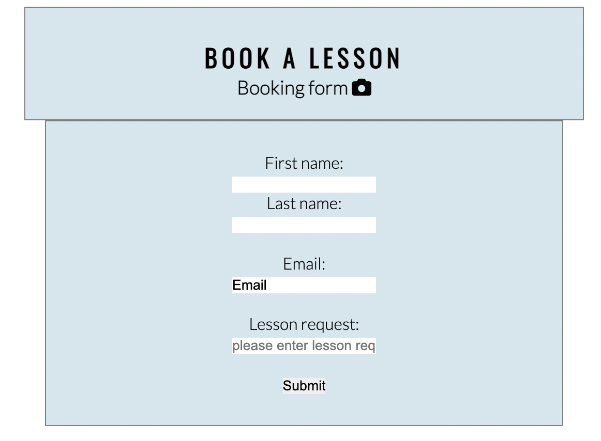

## Testing  
I tested the website on Mac myself, I don't have the financial option to buy a Windows computer too, but luckily my sister let me send her the link to test on her Windows computer.  It has been tested mainly through Google Chrome browser on macOS. 108.0.5359.124. 2022-12-14 and Safari Browser 16.1	2022-10-24.
Having issues downloading the firefox browser on the Macbook so haven't tested on that yet. Have tested the site on mobile devices, don't have the finances to buy an ipad to personally test on one, but have tested it on DevTools tablet/ipad options. 

#### Any issues/bugs -
Text box on form kept going to the right, but now has centered where I want by adapting the css styling. See GitHub commits on the main branch to see all original website changes.
Please be aware that there were technical issues when doing my recent commits from Replit to GitHub and GitHub main branch is now not showing these recent commits. I have let Robert McLaughlin and The Code Institute Student support know this. The main issues that will arise are responsive text box on index on new code has a 1 column rule on smaller devices, so the text doesn't overlap. I have hopefully rectified this by pushing a commit from replit to GitHub in another branch (see 'most-recent') and seeing if that has the desired effect!
I then had to change my repository from Private to Public so I could deploy it.

#### WS3 CSS Validation -
When using WS3 CSS Validation the following occured.
On first go it pulled up that it didn't like the coding 'center center no repeat' which is strange as this is what the course taught us in the Love Running project, so I would like some feedback as to why the validator didn't accept this, but we were taught to write it? Confusing?!  It also didn't like the fontawesome link or the content dispaly type of px, so changed that too.
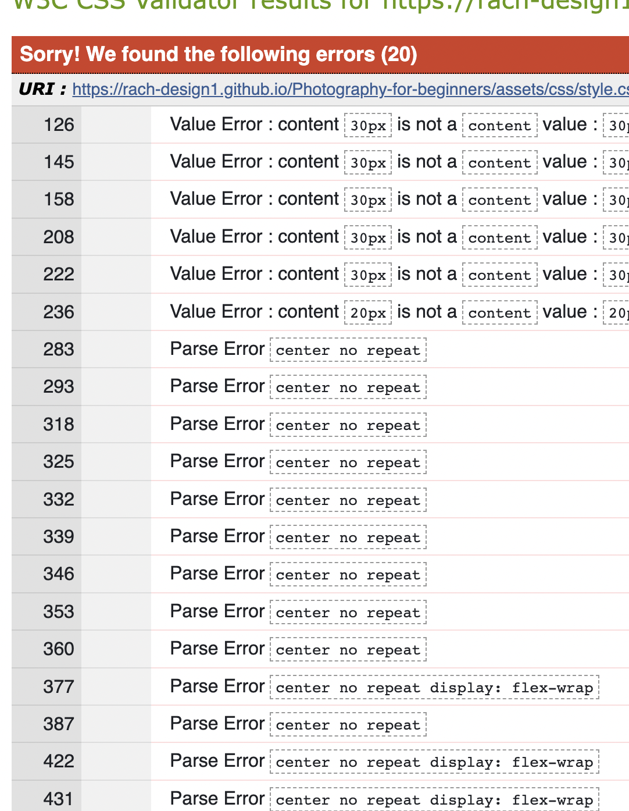

#### Chrome Developer Lighthouse -
Using Lighthouse on Developer (Dev) Tools; this flagged up that under Accessibility it didn't like the Gray text as there was not enough contrast between Gray text and a white background, so gone back to my original colour of Black. I can understand this as Black does seem easier to read now.  Pulled up few images without alt attribute, so added one, but strange that it didn't tell us to on the love running gallery and this was part of our learning material; good Lighthouse picked up on it and gave me the opportunity for more learning.

#### Chrome Developer Lighthouse Scores (Not Incognito mode) - 
##### Below are the Desktop scores - 
Index/Home - Performance: 99 Accessibility: 97 Best Practices: 83 SEO: 100
Taking a Photo - Performance: 97 Accessibility: 97 Best Practices: 92 SEO: 100
Portfolio - Performance: 89 Accessibility: 97 Best Practices: 92 SEO: 100 
Book a Lesson - Performance: 99 Accessibility: 97 Best Practices: 92 SEO: 100

##### Below are the Mobile scores -
Index/Home - Performance: 95 Accessibility: 97 Best Practices: 92 SEO: 95
Taking a Photo - Performance: 94 Accessibility: 97 Best Practices: 92 SEO: 95
Portfolio - Performance: 70 Accessibility: 97 Best Practices: 92 SEO: 95
Book a Lesson - Performance: 95 Accessibility: 97 Best Practices: 92 SEO: 96

## Deployment 
### How to deploy this site
I deployed my website using GitHub Pages.  I did this by pushing a commit from replit to GitHub in another branch (see 'most-recent') and then using this to deploy from.
I then had to change my repository from Private to Public so I could deploy it.

* In GitHub most-recent branch repository, navigate to Settings tab, choose pages tab (on the left)
* From Source section, choose 'Deplo from a Branch' option. Ensure you choose 'most-recent' NOT main! Click Save.
* Click root if not automatically selected
* clicking the visist site button will take you to the site or clicking on the link (as the visit site button didn't come up for me as instructed)
* Any changes and adaptations to the 'most-recent' branch will take effect on the live website.

## Credits/References  
The Photographs used are from four main sources:
Myself - Rachel Lawson, I own the copyright to these images, so nobody can use these without my written permission, (bird.webp, checked.webp, einstein-bird.webp, elle-hand.webp, wildlife.webp, yellow.webp, exposure-triangle.webp). 
My partner Steve Hawkes Photography has also provided me with one image and the same copyright applies to his images(street-male.webp).
The other images were free stock images that were copyright free from www.pexels.com and one was from www.unsplash.com. See below.
pexels-diego-felipe-de-souza-1785134.webp - 'taking photo'
pexels-matheus-bertelli-13832964.webp - 'street'
pexels-yuksel-kocaman-1640057.webp - 'wedding'
will-shirley-xRKcHoCOA4Y-unsplash.webp - 'elephant'
pexels-andre-furtado-1264210.webp - 'camera lady'
pexels-photomix-company-212372.webp - 'lesson times & step by step'

CSS Media Query code snippet columns was referenced from https://www.w3schools.com/cssref/tryit.php?filename=trycss3_media_columns and adapted as necessary.
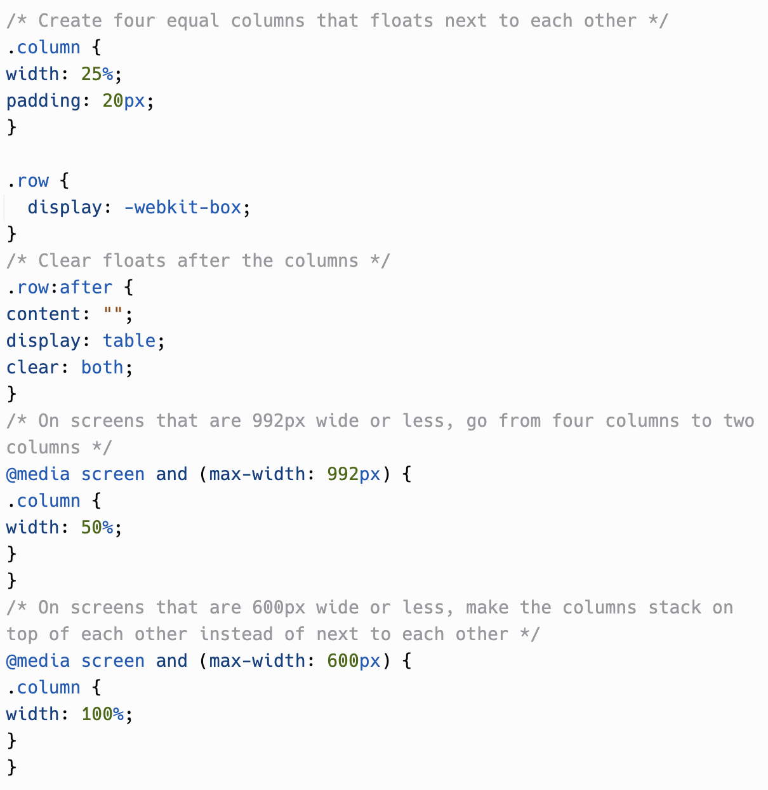

Footer - Code snippet was referenced from Love Running and adapted with adding aria-label to make it more accessible to screen readers, I feel this is highly important.

No Bootstrap were used to code this website as I'd started coding the website when going through the HTML and CSS Sections.

I added a code snippet from Love Running for my 'Photography lessons schedule' and my 'Step by Step guide', as this was super effective way to present this information, so why rewrite the wheel? Furthermore, I replaced all the information text with my own, changed styles a bit and replaced the photo.
It is purposely simple and non distracting, as the website is for beginners so it doesn't need to overly complicate anything! Plus the main purpose is to get someone to take their first photos and to book a lesson if they want to learn more. I really like how effective it is.

## Anything I would add if developing the website further 
If I was developing this site further, then this could be an opportunity to grow the site by adding a blog with additional online lessons; this could incorporate a video as well as text for better accessibility needs.  This would then generate more options for returning users, as well as new users.

## Additional information/Improving my learning experience
Learning better ways to do things more time efficiently and using a more powerful editor than replit (no offence replit, but for next project I'll try GitPod as I've found out now it's the better option).  More clarity on the project and managing the workload in a way that doesn't negatively affect my Health, as I have really struggled with this whilst on this journey. So it is a HUGE achievement to be getting this far. I also feel it is hard going back to education as an Adult learner, as you feel like you haven't done any coursework for a very long time. So setting daily and weekly SMART targets will help. Also celebrating the small accomplishments as well as the bigger ones, they all add up over time.

## Goodbye
Thank you for spending the time looking at my README.md and my Website. I appreciate it. Hopefully you have a go at Photography too; I've been doing Photography for just under a year now and it's amazing fun, really recommend it. It's a great way to create Art, meet new people, experience new places and wildlife too. The main thing is to have fun.

Many thanks,
Rachel Lawson
